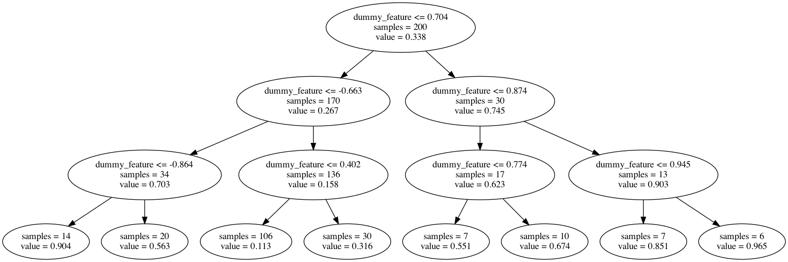

# Implementation of a decision tree from scratch:

There are two implementations of decision trees: one for classification, one for regression
___

## Classification

### General overview: how it works
The output of a call on DecisionTreeClassifier is a dictionary that contains all information relating to a classification decision tree. 
Everytime a node is split, it will store this information within this dictionary, and this nested dictionary procedure continues until our constraints are met: 
either we have reached the desired maximum depth of our tree, or the node size is less than our desired minimum size, or the node is completely pure (only contains one class). In this case we have used the Gini coefficient as the criteria to split the nodes, given it is the most popular criterion in the classification case. 

### Arguments
- max_depth=None -> The maximum depth the tree can be allowed to grow to. This parameter is useful to prevent over-fitting the tree
- min_size=None ->  The minimum size of each node. This parameter is also useful to to prevent over-fitting the tree 


### Functions
Below you can find a short description of all the functions. 

- calculate_gini: this calculates the gini of any node. 

- get_split: given the parent node, this returns the information relating to the two child nodes, which are found based on the smallest gini. It returns a dictionary containing the node's index to split on, the value to split by, the rows from the dataset in the left and right node, and the gini at this optimal split. 

- final_label: this assigns a class to the terminal nodes


- recursive_split: allows our tree to continue splitting until our constraints are violated. 

- grow_tree: builds out our tree 


- predict_one_row: given a row in the dataset, it outputs the predicted class.

- predict: predicts a class for each row in the dataset and appends this to a list. 

- dataset: merges our X and Y dataset into one numpy array for simplicity

- fit: fits our tree on the training data

- accuracy: returns the accuracy of our predictions on the test set. 

___

## Regression:

### General overview: how it works

The class is an attempt to implement the sklearn library's DecisionTreeRegressor. 
When the class is initialised, the object is treated as our root node. 
On calling the fit function, new objects of the same class are created and added as children to the nodes recursively, 
based on the best split, decided by the criterion used.

### Arguments:
- criterion='mse' -> Criterion used to minimise the impurity of a node. Can be "mse" for mean square error, or "mae" for mean average error.
- max_depth=None -> The maximum depth the tree can be allowed to grow to. This parameter is useful to prevent over-fitting the tree
- min_samples_split=None -> Minimum number of samples required in a node to consider splitting it.
- min_impurity_decrease=None -> Minimum decrease in the impurity to consider splitting a node.


### Functions
- fit: Fits our tree on the input data.
- predict : Returns the predicted values for the input data.
- score : Gives the r2 value for the predicted values.
- show_tree : Allows the user to visualize the fitted tree.

Other functions are for internal purposes and not intended for user calls. 

- Important for show_tree function call:
It uses pydot library to generate the drawing and graphviz must be installed in the user's environment. 
This is **different** from simply doing ```pip install graphviz```, which does not download the executables of graphviz. 
Mac users can simply use ```brew install graphviz``` if they have brew installed.

The function call generates and saves an image like this:




### Usage example:
```
from decision_tree.DecisionTreeRegressor import DecisionTreeRegressor

reg = DecisionTreeRegressor(criterion='mse', max_depth=4)
reg.fit(X_train, y_train)

pred = reg.predict(X_test)
```

An example of usage can be found in file "tester.py" under "Regression Example"

___
