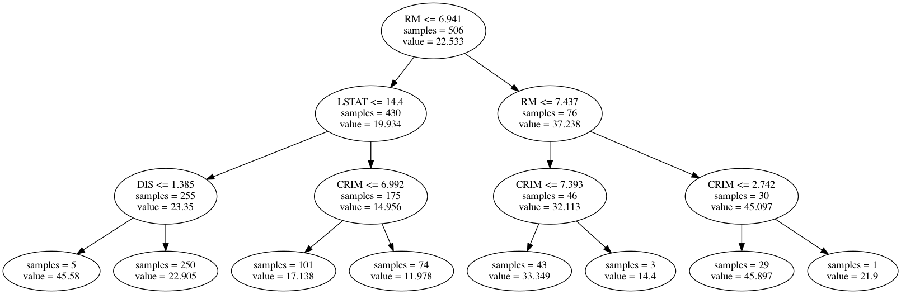

# Implementation of a decision tree from scratch:

There are two implementations of decision trees: one for classification, one for regression

### DecisionTreeRegressor:

The class is an attempt to implement the sklearn library's DecisionTreeRegressor and uses following arguments (and their default values) to initialise the tree:

#### Arguments:
 criterion='mse' -> Criterion used to minimise the impurity of a node. Can be "mse" for mean square error, or "mae" for mean average error.

 max_depth=None -> The maximum depth the tree can be allowed to grow to. This parameter is useful to prevent over-fitting the tree

 min_samples_split=None ->

 min_samples_leaf=None ->

 min_impurity_decrease=None -> Minimum decrease in the impurity to consider splitting a node.

#### Usage example:
```
from decision_tree.DecisionTreeRegressor import DecisionTreeRegressor

reg = DecisionTreeRegressor(criterion='mse', max_depth=4)
reg.fit(X_train, y_train)

pred = reg.predict(X_test)
```

An example of usage can be found in file "tester.py" under "Regression Example"

#### Visualization of tree

.show_tree function allows the user to visualize the fitted tree.

It uses pydot library to generate the drawing and graphviz must be installed in the user's environment. This is **different** from doing ```pip install graphviz```, which does not download the executables of graphviz. Mac users can simply use ```brew install graphviz``` if they have brew installed.

The function call generates and saves an image like this:



